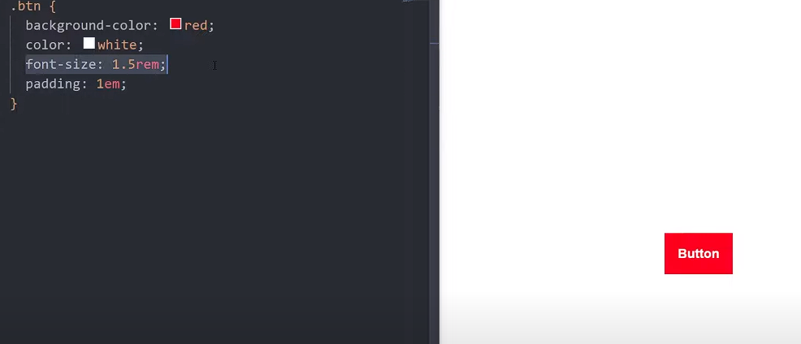

# Units

There are two type of units :

    1. Absoulte - precise and fixed units apply to the elements. e.x- px(pixel)

    2. Relative - these units are relative to font size or relative to view port.(rem, em)

> OUT OF ALL THESE ONLY 5 WE NEED TO KNOW 

****px**, **em**, **rem**, **ch**, **vh****

## px 

it the most hard one to understand.

thats all :)

## em and rem

* if you give `em` unit to `font-size` it is realtive to its parents size.

* so the problem with `em` unit is relative to its parent and if its parent also have `em` unit it going to realtive to its `parent` so it create the cascading problem.

* however if we give em unit to other then `font-size` it is realtive to its font-size of `own element.

* so to solve this problem we give `rem` unit to font-size `which is realtive to the root element`(which is our html element)

>NOTE- 
1. dont give em units to font-size property of the element.
2. use rem for your font size.

## %, VH, VW unit

% unit are relative to their parents.

however you dont want the width to be realtive the parent we can use the VW unit.

NOTE- 
1. use % if we want to relative to ther parents and use View port units when you want realtive to the view ports.
